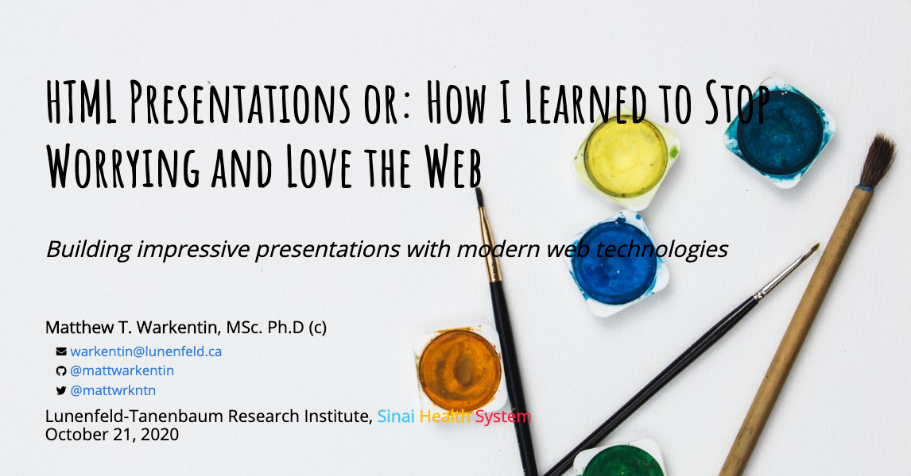

```{r, include = FALSE}
knitr::opts_chunk$set(
  collapse = TRUE,
  comment = "#>"
)
```

# HTML Presentations or: How I learned to Stop Worrying and Love the Web



### Building impressive presentations with modern web technologies

__Author__: Matthew T. Warkentin (<warkentin@lunenfeld.ca>)

&#x1F4FA; [__Click to View Slides__](https://mattwarkentin.github.io/html-presentations-or-hiltswaltw/)
